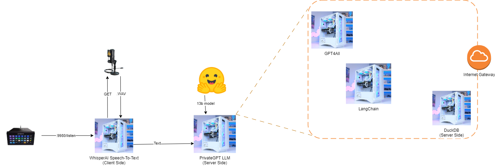

# NeuroQuack

NeuroQuack is a cutting-edge tool for analyzing and classifying the vocalizations of ducks using machine learning techniques.  NeuroQuack utilizes the Short-Time Fourier Transform (STFT) to extract features from audio signals, which are then used to train machine learning models to accurately classify different types of duck vocalizations. With its advanced algorithms and user-friendly interface, NeuroQuack is a powerful tool for researchers and enthusiasts alike who want to better understand and study the behavior of these fascinating creatures.

Well, actually it's a Speech-To-Text-To-LLM-To-Text-To-Speech process using RESTful APIs and harnessing the power of ephemeral environments and per-compute microservice methodolgy in order to deliver Quacks at an efficient rate and time to allow for Ducklings to learn Quackly!

MVP: Minimal Viable Product

The MVP is a single binary. The final product is a distributed system that separates the compute requirements and uses the most efficient infrastructure available per-method using Python Attribution.

## Tech Stack (Needs)

- Python
- FastAPI
- Terraform
- AWS
  - Lambda
  - ECS
    - Fargate
  - API Gateway
    - Lambda Authorizer
  - Load Balancing
    - Network Load Balancer
    - mTLS Termination
  - Route53, VPC, Subnets

------

## Brain Dump (Wants)

- S3 Front End
- CloudFront
- Webpage for SaaS offering with a clearly defined cost model based on compute

## Backlog

- Discord Bot
- Twitch Bot

---

